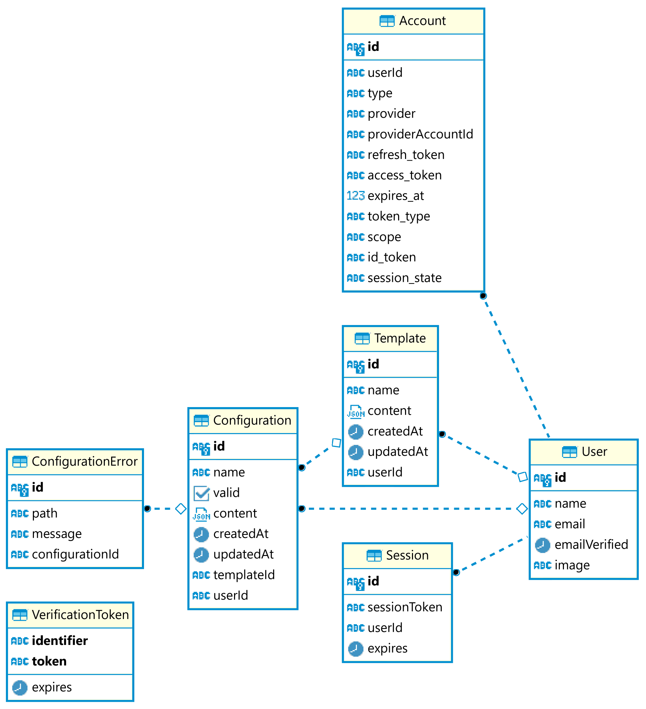

# Configify

This is a repo for the bachelor's degree project in Computer Science at the Norwegian University of Science and Technology (NTNU).
The project is a full-stack application for creating, managing, and validating JSON configuration files.

### Built With
* [Next.js](https://nextjs.org/) - A React-based framework for building server-rendered or statically-exported React applications.
* [NextAuth](https://next-auth.js.org/) - A complete open-source authentication solution for Next.js applications.
* [TypeScript](https://www.typescriptlang.org) - A superset of JavaScript that adds static typing.
* [Prisma](https://www.prisma.io/) - An open-source next-generation ORM for Node.js and TypeScript.
* [tRPC](https://trpc.io/) - An end-to-end type-safe RPC library for building APIs with TypeScript and Node.js.
* [Chakra UI](https://chakra-ui.com/) - A simple, modular and accessible component library for building React applications.
* [AJV](https://ajv.js.org/) - A JSON Schema validator for JavaScript.
* [Yarn](https://yarnpkg.com/) - A fast, reliable, and secure dependency management tool.
* [Vercel](https://vercel.com/) - A platform for deploying and scaling frontend web projects.

## Getting Started

To get a local copy up and running follow these simple steps.

### Prerequisites

This is a list of things you need in order to use this application.

* Node.js
* Yarn

#### Downloading the project

**Via HTTPS:**
```sh
git clone https://github.com/nilssen98/bachelor-project.git
```
**Via SSH:**
```sh
git clone git@github.com:nilssen98/bachelor-project.git
```
or download it directly as a zip from [here](https://github.com/nilssen98/bachelor-project/archive/refs/heads/master.zip).

### Usage methods

#### Deployment [Recommended]

1. Head to [https://bachelor-project-rose.vercel.app/](https://bachelor-project-rose.vercel.app/)
   to see the website in operation. <br>
   This is the preferred method.

### Other usage methods

#### Locally

1. Make sure you have installed Node.js and Yarn on the system.
2. Download and the extract zip-file **or** clone project to the desired location as specified in the ["Downloading the project"](#downloading-the-project) section.
3. Run the command `yarn install` in the project root.
4. Copy the env.example file in this directory to .env.development (which will be ignored by Git):
    ```bash
    cp env.example .env.development
    ```
5. Fill in the secrets for all the providers in the .env.development file.
6. Run the command `yarn dev` in the project root.
7. The website should then be available at [http://localhost:3000](http://localhost:3000)

#### Docker

You can deploy this project with Docker.

1. Make sure you have Docker installed on your system.
2. Copy and fill in the secrets for all the providers in the .env.production file like mentioned in the ["Locally"](#locally) section.
3. Run the following command in the project root:
   ```bash
   docker compose up
   ```
   Or just rebuild the project without touching the database:
   ```bash
   docker-compose up --build app
   ```
4. The website should then be available at [http://localhost:3000](http://localhost:3000)

Other useful commands:

`-d` Detached mode: Run containers in the background


## Database

When setting up a new project, you need to run this command once to generate the Prisma Client.
This generates the Prisma Client APIs that allow you to interact with the database.

```bash
yarn prisma generate
```

To sync the database schema with the Prisma schema, run the following command:

```bash
yarn prisma db push
```

This command should be used after creating a new database or after making any changes to the `schema.prisma` file.

Prisma sometimes refuses to correctly read the environment variables, so we included a script that uses `dotenv-cli` to read the environment variables from the correct `.env` file.

One needs to have `dotenv-cli` installed globally to use this script.

```bash
yarn db:push
```

### Database Schema

The following is our database schema:



## API Endpoint Tests

We have included Postman tests for the `/api/validate` endpoint. 
These tests can be found in the [docs/postman](docs/postman) directory.

Here is an example of how to use the `/api/validate` endpoint with Postman:

1. Open Postman and create a new request.
2. Set the HTTP method to `POST`.
3. Enter the URL of your endpoint in the request URL field.
4. Select the `Body` tab.
5. Select the `raw` option.
6. Select `JSON` as the format.
7. Enter the JSON object you want to validate in the text area like shown below.
   ```json
   {
     "configuration": "Your configuration here as a string",
     "schema": "Your schema here as a string"
   }
   ```
8. Click the `Send` button to send the request.

Keep in mind that this endpoint takes in a JSON object as a string, so you need to escape the quotes in the JSON object.

## Acknowledgements

This is a [T3 Stack](https://create.t3.gg/) project bootstrapped with `create-t3-app`.
